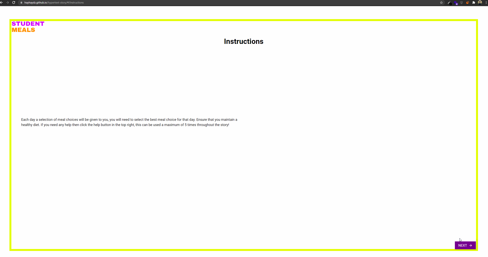

# Hypertext Story

The original brief described a rather linear story that had one path and outcome. I decided to create a dynamic story that could change based on the results that the user was getting. This meant that if the user picked a good diet a long the way they would get good feedback, but if they made worse diet choices their story would change for the worse. This was built with React.

### Screen Capture

To use this application [click here](https://hayhaydz.github.io/hypertext-story/#/)
